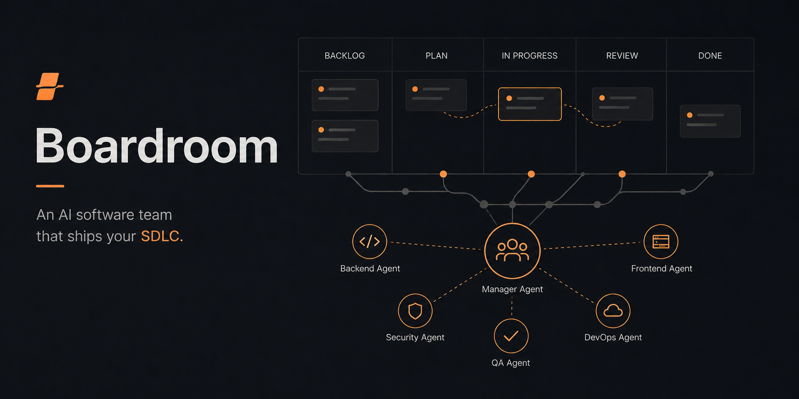
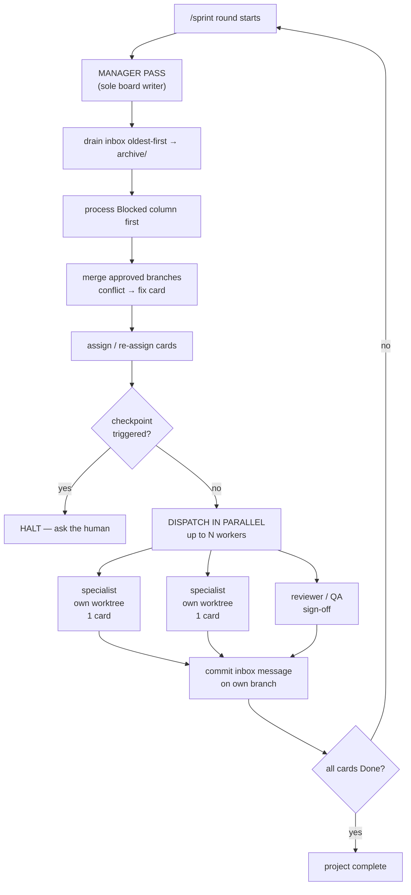

<p align="center">
  
</p>

<h1 align="center">Boardroom</h1>

<p align="center">
  <b>A Claude Code plugin that runs a software team.</b><br>
  One manager, a roster it builds for your project, and a Kanban board they actually work off.
</p>

<p align="center">
  <a href="#install">Install</a> ·
  <a href="#quickstart">Quickstart</a> ·
  <a href="#how-it-works">How it works</a> ·
  <a href="#the-team">The team</a> ·
  <a href="#commands">Commands</a> ·
  <a href="#dashboard">Dashboard</a>
</p>

---

## What it is

You describe what you want built. Boardroom stands up a **manager agent** that reads the brief, decides which specialists the job needs, writes those specialists into your project as real agents, and puts the work on a Markdown Kanban board at `.sdlc/kanban.md`.

Then it runs the project. Each round, specialists claim their cards, **write real code in your repository** — each in its own git worktree, so they run in parallel without stepping on each other — and report back. The manager reviews, merges, re-plans, and comes back to you only at checkpoints that matter.

**The board is the product.** It is plain Markdown, committed to your repo, so the entire project history is greppable, diffable, and replayable — no database, no SaaS, no lock-in.

## Why it's built this way

| Problem with naive multi-agent setups | What Boardroom does |
|---|---|
| Agents overwrite each other's files | Every worker runs in its own **git worktree** on its own branch; the manager merges one at a time |
| Agents overwrite each other's *state* | **Exactly one writer** of the board. Workers can only *request* changes, via a file queue |
| "Done" means whatever the agent says | **Definition of Done is checkboxes**, and each box is owned by the role responsible for it |
| Agents drift, invent, and run away | **Human checkpoints** halt the loop: plan approval, phase gates, security escalations, round caps |
| No idea what happened | Every message is archived verbatim. `archive/` + `git log` reconstructs the whole project |

---

## Install

Boardroom is its own plugin marketplace. In Claude Code, send these as **two separate prompts**:

```
/plugin marketplace add majipa007/boardroom
```

```
/plugin install sdlc-team@boardroom
```

Restart Claude Code (or `/reload-plugins`) and the `/sdlc-*` commands appear.

<details>
<summary><b>Local / dev install</b> (no marketplace)</summary>

```bash
git clone git@github.com:majipa007/boardroom.git
claude --plugin-dir ./boardroom/sdlc-team
```

Validate any time:

```bash
claude plugin validate ./sdlc-team --strict
```
</details>

> The marketplace is named `boardroom`; the plugin inside it is `sdlc-team` — hence `sdlc-team@boardroom`.
> The dashboard needs **Node.js ≥ 18**. Nothing else. No `npm install`, no dependencies.

## Quickstart

From inside the repository you want built:

```
/sdlc-init
```
Answer a few questions about the project. The manager picks a methodology, composes the team, drafts the backlog, and **stops for your approval**. (First run creates `.claude/agents/` — restart Claude Code once so the new specialists load.)

```
/sprint
```
The team works in rounds until the board is clear or something needs you.

```
/status
```
Read-only snapshot, any time.

---

## How it works



The rules that make it hold together:

- **One writer.** Only the manager edits `.sdlc/kanban.md`. Workers never touch it — they drop a message in `.sdlc/inbox/` requesting a change, and the manager decides.
- **Messages are the audit log.** The manager processes the inbox oldest-first and moves each file *unchanged* into `.sdlc/archive/`. That archive plus `git log` is a complete, replayable project history.
- **Parallel, isolated, merged deliberately.** Each worker gets its own git worktree and branch (`sdlc/T-014-jwt-refresh`). The manager merges one branch at a time in approval order; a merge conflict becomes a **fix card**, never a blind resolution.
- **Done is mechanical.** Every card carries a Definition of Done as checkboxes, and a box may only be checked by the role that owns it — QA owns test boxes, the security reviewer owns security boxes, the implementer owns implementation boxes. A card reaches Done only when every box is checked.
- **The session can't quietly abandon work.** A Stop hook blocks the session from ending while cards are still open, unless the board is legitimately waiting on you.

### Anatomy of a card

```markdown
### T-014 | Implement JWT refresh endpoint
- assignee: Backend Developer
- priority: high
- depends-on: [T-011]
- branch: sdlc/T-014-jwt-refresh
- what: |
    Add POST /auth/refresh. Rotate refresh tokens, invalidate the old token,
    return a new access+refresh pair. Follow the error envelope in src/api/errors.ts.
- definition-of-done:
  - [ ] Endpoint returns correct status codes (200/401/403)
  - [ ] Unit + integration tests passing        (QA verifies)
  - [ ] No new high/critical findings           (Security signs off)
  - [ ] Branch merges cleanly to main           (Manager verifies)
- status-log:
  - 2026-07-25T10:02 created
  - 2026-07-25T10:31 started (worktree created)
```

### What it creates in your project

```
.sdlc/
├── kanban.md           # THE BOARD — manager writes, everyone reads
├── team.md             # the composed roster + role boundaries
├── project-config.md   # methodology, checkpoints, decision log
├── inbox/              # worker → manager messages, awaiting processing
└── archive/            # processed messages, verbatim (project history)

.claude/agents/         # the specialists the manager wrote for this project
```

Commit `.sdlc/` — it *is* your project-management record.

---

## The team

Three roles are always present, and ship with the plugin:

| Agent | Role | Writes code? | Hard boundary |
|---|---|---|---|
| `manager` | Manager / Orchestrator | No | The only writer of the board. Decomposes, assigns, merges, runs checkpoints, composes the team. Never implements features. |
| `security-reviewer` | Security | No | Reviews branch diffs, rates findings `low`→`critical`, files fixes as proposed tasks. High/critical **halts the loop**. Never fixes code itself. |
| `qa-engineer` | QA | Tests only | Runs and writes tests, verifies DoD boxes, signs off cards. Never modifies non-test source. |

**Everything else is composed for your project.** There is no fixed developer list. At `/sdlc-init` the manager reads your brief and creates exactly the specialists it needs — writing each one as a real agent file into `.claude/agents/<role>.md`, with its own scope and hard "you do not touch this" boundaries, and recording the roster in `.sdlc/team.md`.

```
brief: "iOS app, ML recommender, and a REST API behind it"

composed roster:
  manager · security-reviewer · qa-engineer     (always)
  ios-developer                                 ← invented for this project
  ml-engineer                                   ←
  backend-developer                             ←
```

A brief with no UI gets no frontend role. A data pipeline project gets a data engineer. If a card later needs a specialist that doesn't exist yet, the manager creates that role mid-project (hot-loaded, no restart).

---

## Commands

| Command | What it does |
|---|---|
| `/sdlc-init` | Interview you, pick a methodology, compose the team, scaffold `.sdlc/`, draft the backlog, stop for approval. |
| `/sprint [rounds]` | Run the loop: manager pass → parallel dispatch → repeat, until the board is clear or a checkpoint fires. Optional arg caps the rounds. |
| `/status` | Read-only board summary: column counts, blocked cards, current phase, recent history. |
| `/standup` | One line per team member — what they finished, what they're starting. |
| `/sdlc-override <methodology\|key=value>` | Change methodology or config; the manager restructures the board and logs the decision. |
| `/sdlc-dashboard [--port N] [--root DIR]` | Launch the local web dashboard. |

### Methodology

The manager picks one from your brief, writes down *why*, and you can override it at the approval checkpoint or later with `/sdlc-override`:

| Your brief looks like | It picks |
|---|---|
| Requirements vague, expected to evolve | **Agile** — sprints, sprint reviews as gates |
| Steady stream of small tasks, no sprint rhythm | **Kanban** — no sprints, gate every N cards |
| Requirements fixed, compliance, hard sequencing | **Waterfall** — phase gates |
| Fixed core + exploratory layer | **Hybrid** — waterfall skeleton, agile inside implementation |

Methodology changes how work is batched and where gates fall. The board and queue mechanics never change.

### Checkpoints — where it stops and asks you

1. **Plan approval** — nothing is written until you approve the methodology and backlog.
2. **Sprint / phase gate** — end of a sprint, phase, or every N cards.
3. **Security escalation** — any high/critical finding halts the loop immediately.
4. **Blocked escalation** — a card explicitly asking for you, or blocked two rounds running.
5. **Round cap** — hits `max-rounds-per-sprint` (default 20) with work still open.

---

## Dashboard

```
/sdlc-dashboard
```

A zero-dependency local web UI at `http://localhost:8787` that watches **every** Boardroom project on your machine, most-recently-active first — and for each: the composed team, the live board, the inbox, and the archive. It polls every 5 seconds and repaints only when something actually changed.

Two themes over the same board, toggled from the header and remembered across reloads:

| Theme | Looks like |
|---|---|
| **Sprint Wall** (default) | Sticky notes pinned to a plaster wall — painter's-tape column headers, handwritten titles, a 🔥 on high-priority cards |
| **Blueprint** | Drafting paper — grid, 1px linework, square spec-sheet cards, rotated `HOLD`/`W.I.P.`/`INSPECT`/`MERGED` stamps, `RFI → HUMAN` callouts, and a drawing title block |

It is strictly **read-only**. It never writes to your projects.

Projects register themselves at `/sdlc-init` (tracked in `~/.sdlc-team/projects.json`). Pass `--root <dir>` to also scan a workspace for boards created elsewhere.

---

## Requirements

- **Claude Code** (plugin support).
- **Node.js ≥ 18** — only for `/sdlc-dashboard`. Everything else is plain Markdown and POSIX shell.
- **git** — worktrees and branches are how workers stay isolated.

## Not in scope (v1)

External integrations (GitHub Issues / Slack / CI providers), the security reviewer fixing code itself, multiple concurrent boards in one repo, and token budgeting beyond the round cap.

## Repository layout

```
boardroom/
├── .claude-plugin/marketplace.json   # makes this repo installable
├── sdlc-team/                        # the plugin
│   ├── .claude-plugin/plugin.json
│   ├── agents/                       # manager, security-reviewer, qa-engineer
│   ├── commands/                     # the /sdlc-* commands
│   ├── skills/sdlc-board/            # board schemas + templates
│   ├── hooks/                        # Stop hook
│   └── scripts/                      # dashboard + board-check, with tests
└── docs/                             # build spec + implementation plans
```

## License

None yet — add one before wider distribution if you want to set usage terms.
