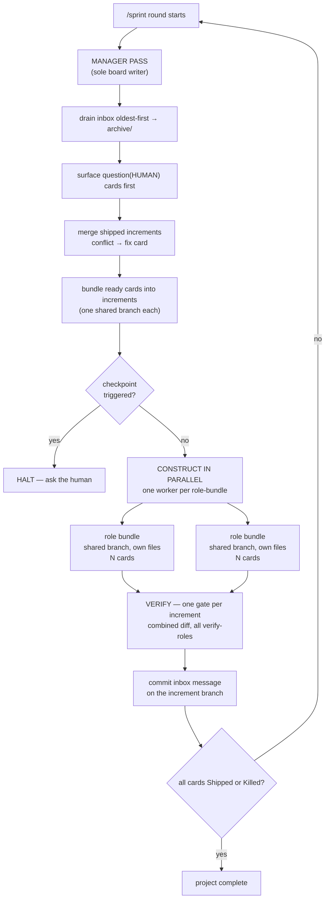

<p align="center">
  
</p>

<h1 align="center">Boardroom</h1>

<p align="center">
  <b>A Claude Code plugin that runs a software team.</b><br>
  One manager, a roster it builds for your project, and a Kanban board they actually work off.
</p>

<p align="center">
  <a href="#install">Install</a> ·
  <a href="#quickstart">Quickstart</a> ·
  <a href="#how-it-works">How it works</a> ·
  <a href="#roles-minted-on-demand">Roles</a> ·
  <a href="#commands">Commands</a> ·
  <a href="#dashboard">Dashboard</a>
</p>

---

## What it is

You describe what you want built. Boardroom stands up a **manager agent** that reads the brief, decides which specialists the job needs, and keeps them as a **role registry** — spawning a generic `worker` or `reviewer` with that role's charter injected, rather than writing agent files or restarting anything — while it puts the work on a Markdown Kanban board at `.sdlc/kanban.md`.

Then it runs the project. Each round, the manager bundles every ready card into an **increment** — a dynamically-sized batch, no size cap — and specialists **write real code in your repository** together on that increment's one shared branch, kept apart only by explicit file ownership, never a worktree. The manager reviews the increment's combined diff once, merges, re-plans, and comes back to you only at checkpoints that matter.

**The board is the product.** It is plain Markdown, committed to your repo, so the entire project history is greppable, diffable, and replayable — no database, no SaaS, no lock-in.

## Why it's built this way

| Problem with naive multi-agent setups | What Boardroom does |
|---|---|
| Agents overwrite each other's files | No worktrees — every agent in a cycle shares **one increment branch**, kept apart by **explicit file ownership** the manager assigns in the spawn prompt; no agent may move HEAD |
| Agents overwrite each other's *state* | **Exactly one writer** of the board. Workers can only *request* changes, via a file queue |
| "Done" means whatever the agent says | **Definition of Done is checkboxes**, and each box is owned by the role responsible for it |
| Agents drift, invent, and run away | **Human checkpoints** halt the loop: plan approval, phase gates, security escalations, round caps |
| No idea what happened | Every message is archived verbatim. `archive/` + `git log` reconstructs the whole project |

---

## Install

Boardroom is its own plugin marketplace. In Claude Code, send these as **two separate prompts**:

```
/plugin marketplace add majipa007/boardroom
```

```
/plugin install sdlc-team@boardroom
```

Restart Claude Code (or `/reload-plugins`) and the `/sdlc-*` commands appear.

<details>
<summary><b>Local / dev install</b> (no marketplace)</summary>

```bash
git clone git@github.com:majipa007/boardroom.git
claude --plugin-dir ./boardroom/sdlc-team
```

Validate any time:

```bash
claude plugin validate ./sdlc-team --strict
```
</details>

> The marketplace is named `boardroom`; the plugin inside it is `sdlc-team` — hence `sdlc-team@boardroom`.
> The dashboard needs **Node.js ≥ 18**. Nothing else. No `npm install`, no dependencies.

## Quickstart

Write down what you want built, then point boardroom at it. From inside the repository:

```
/boardroom docs/spec.md
```

That's it. It reads your document, plans the work, shows you the plan once, and then **builds
it to completion** — construct, verify, ship, repeat — without you running another command.
Add `--go` to skip even the plan approval.

Two optional extras while it runs:

```
/sdlc-dashboard     watch the board live in a browser
/status             where things stand, right now
```

Run `/boardroom` with no arguments and it tells you what everything is.

---

## How it works



The rules that make it hold together:

- **One writer.** Only the manager edits `.sdlc/kanban.md`. Workers never touch it — they drop a message in `.sdlc/inbox/` requesting a change, and the manager decides.
- **Messages are the audit log.** The manager processes the inbox oldest-first and moves each file *unchanged* into `.sdlc/archive/`. That archive plus `git log` is a complete, replayable project history.
- **Shared branch, explicit ownership, no worktrees.** An increment is a dynamically-sized bundle of ready cards — no size cap — built together on one branch (`sdlc/inc-##-<slug>`). Every agent working that increment shares the same checkout; the manager tells each one exactly which files it owns, and no agent may run `git checkout/switch/reset/stash` or `git add -A` — HEAD is shared, and moving it would corrupt every other agent's work in that round.
- **One verification gate per increment.** Once every card in the bundle is done, all of that increment's verify-roles review the combined diff in a single parallel round — tests, review and security together, batched instead of per-card. A high/critical security finding still halts everything before the merge; a failing test run still blocks the merge unconditionally.
- **Shipped is mechanical.** Every card carries a Definition of Done — capped at ~3 checkboxes plus a one-line `ships-when:` — and a box may only be checked by the role that owns it. A card reaches Shipped only once every box is checked and its increment is verified and merged.
- **The session can't quietly abandon work.** A Stop hook blocks the session from ending while cards are still open, unless the board is legitimately waiting on you.
- **Roles, not people.** The manager keeps a role registry and spawns a generic `worker` or
  `reviewer` with the role's charter injected — so a new specialist costs a registry entry,
  not a restart.
- **Autopilot.** With `autopilot: on` the loop runs continuously and halts only on five hard
  stops; everything else is logged as an auto-decision.

### Anatomy of a card

```markdown
### T-014 | Implement JWT refresh endpoint
- role: R-01 backend
- verify-roles: [R-04 sec-review, R-05 qa-verify]
- priority: high
- depends-on: [T-011]
- branch: sdlc/inc-03-auth-refresh
- what: |
    Add POST /auth/refresh. Rotate refresh tokens, invalidate the old token,
    return a new access+refresh pair. Follow the error envelope in src/api/errors.ts.
- ships-when: POST /auth/refresh rotates tokens and the suite is green.
- definition-of-done:          # keep to 3 boxes or fewer
  - [ ] Endpoint returns correct status codes (200/401/403)
  - [ ] Tests green                              (qa-verify verifies)
  - [ ] No high/critical findings                (sec-review signs off)
- status-log:
  - 2026-07-25T10:02 created
  - 2026-07-25T10:31 started (bundled into inc-03, shared branch)
```

### What it creates in your project

```
.sdlc/
├── kanban.md           # THE BOARD — manager writes, everyone reads
├── team.md             # the role registry + role boundaries
├── project-config.md   # methodology, checkpoints, decision log
├── inbox/              # worker → manager messages, awaiting processing
└── archive/            # processed messages, verbatim (project history)
```

Commit `.sdlc/` — it *is* your project-management record.

---

## Roles, minted on demand

Three agents ship: `manager` (orchestrates, owns the board), `worker` (builds a role's bundle
of cards on the shared increment branch, scoped to the files it owns), `reviewer` (verifies
an increment's combined diff, read-only on source).

The team is a **role registry** in `.sdlc/team.md` that the manager grows as the project
needs it — each role has a stable id, a charter, hard boundaries, and conventions that
accumulate over time:

```
card needs "rotate refresh tokens"
  -> registry scan: R-01 backend covers it        -> reuse, no mint
card needs "train a recommender"
  -> nothing covers it                            -> mint R-06 ml, log the decision
```

Reuse beats minting, charter edits beat replacements, and retired roles are kept so history
still resolves. Every card carries mandatory `verify-roles` chosen by risk class, and cannot
reach Shipped until each has signed off — with the implementer never allowed to be the verifier.

---

## Commands

**You normally only need the first one.**

| Command | What it does |
|---|---|
| **`/boardroom <doc> [--go]`** | **The one command.** Reads your spec, plans it, then builds it to completion unattended. With no arguments it explains everything else. |
| `/sdlc-init [doc]` | Set the board up from a document (or a short interview) and stop — for when you want to drive the cycles yourself. |
| `/sprint [rounds]` | Run cycles by hand: construct → verify → cutover. Rarely needed; `/boardroom` runs these for you. |
| `/status` | Read-only board summary: column counts, blocked cards, current phase, recent history. |
| `/standup` | One line per team member — what they finished, what they're starting. |
| `/sdlc-override <methodology\|key=value>` | Change methodology or config; the manager restructures the board and logs the decision. |
| `/sdlc-dashboard [--port N] [--root DIR]` | Launch the local web dashboard. |

### Methodology

**RAD** (Rapid Application Development) is the default and the only auto-selected methodology:
**construct** — each free role takes the maximal coherent bundle of ready cards it can own and
builds it on one increment branch; **verify** — one gate over the combined diff (tests, review,
security) in a single parallel round; **cutover** — merge, and the next construct cycle starts
immediately. `waterfall` is the sole manual override, for genuinely fixed-spec compliance work
with hard sequencing (`/sdlc-override waterfall`) — phase gates instead of increments. There is
no Agile/Kanban/Hybrid choice to make; RAD's construct → verify → cutover loop is the ceremony
those existed to provide, without the per-card tax.

### Checkpoints (normal mode) — where it stops and asks you

1. **Plan approval** — nothing is written until you approve the methodology and backlog.
2. **Sprint / phase gate** — end of a sprint, phase, or every N cards.
3. **Security escalation** — any high/critical finding halts the loop immediately.
4. **Blocked escalation** — a card explicitly asking for you, or blocked two rounds running.
5. **Round cap** — hits `max-rounds-per-sprint` (default 20) with work still open.

### Hard stops (autopilot) — the only five things that halt it

With `autopilot: on` (or `/sprint --auto`), the five checkpoints above stop being individual
stops. Only these five halt the loop, and only at a round boundary:

1. **Init approval** — the initial plan has not been approved yet.
2. **High/critical security finding** — any escalation from a security-review role.
3. **Open `question(HUMAN)`** — questions raised mid-round are not queued to a file; they stay
   on the board as Blocked `question(HUMAN)` cards and are presented together at the end of
   the round.
4. **Round cap** — `max-rounds-per-sprint` (default 20) reached with work still open.
5. **Completion** — every card is in Done.

A sprint/phase gate and a blocked escalation no longer stop the loop in autopilot — the
former emits a gate report and continues, the latter is queued like a `question(HUMAN)`.
Everything else (role mints, charter edits, allocation, serialization, fix cards) is an
auto-decision logged to the Decision Log.

---

## Dashboard

```
/sdlc-dashboard
```

A zero-dependency local web UI at `http://localhost:8787` that watches **every** Boardroom project on your machine, most-recently-active first — and for each: the composed team, the live board, and a recent-activity feed drawn from the archive. It polls every 5 seconds and repaints only when something actually changed.

Two themes over the same board, toggled from the header and remembered across reloads:

| Theme | Looks like |
|---|---|
| **Sprint Wall** (default) | Sticky notes pinned to a plaster wall — painter's-tape column headers, handwritten titles, a 🔥 on high-priority cards |
| **Blueprint** | Drafting paper — grid, 1px linework, square spec-sheet cards, rotated `HOLD`/`W.I.P.`/`INSPECT`/`MERGED` stamps, `RFI → HUMAN` callouts, and a drawing title block |

Every Definition-of-Done checkbox is clickable: ticking or un-ticking one writes a `dod-check` inbox message (`from: Human`) instead of touching the board directly, and the box shows `unchecked → pending → checked` (or the reverse) as the Manager applies it on its next pass. That is the dashboard's **only** write path — it writes exclusively into `.sdlc/inbox/` and never edits `kanban.md`, `team.md`, or any source file.

Projects register themselves at `/sdlc-init` (tracked in `~/.sdlc-team/projects.json`). Pass `--root <dir>` to also scan a workspace for boards created elsewhere.

---

## Requirements

- **Claude Code** (plugin support).
- **Node.js ≥ 18** — only for `/sdlc-dashboard`. Everything else is plain Markdown and POSIX shell.
- **git** — one branch per increment; no worktrees.

## Not in scope (v1)

External integrations (GitHub Issues / Slack / CI providers), the security reviewer fixing code itself, multiple concurrent boards in one repo, and token budgeting beyond the round cap.

## Repository layout

```
boardroom/
├── .claude-plugin/marketplace.json   # makes this repo installable
├── sdlc-team/                        # the plugin
│   ├── .claude-plugin/plugin.json
│   ├── agents/                       # manager, worker, reviewer
│   ├── commands/                     # the /sdlc-* commands
│   ├── skills/sdlc-board/            # board schemas + templates
│   ├── hooks/                        # Stop hook
│   └── scripts/                      # dashboard + board-check, with tests
└── docs/                             # build spec + implementation plans
```

## License

None yet — add one before wider distribution if you want to set usage terms.
